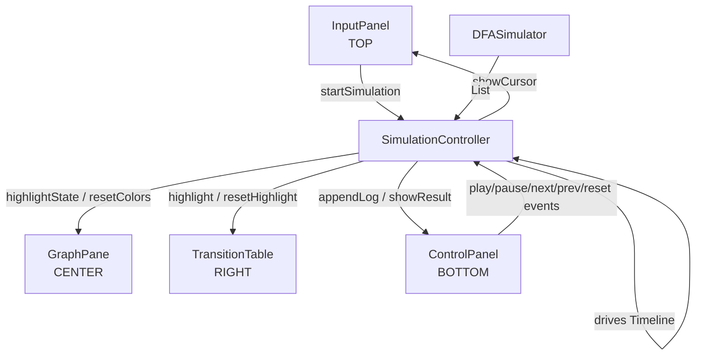
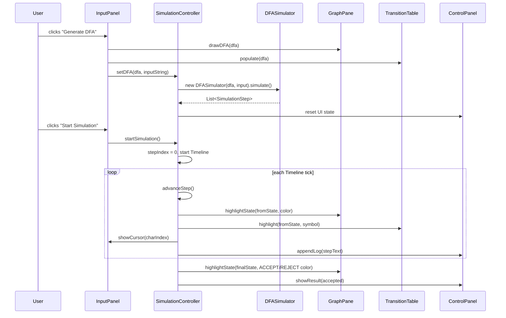
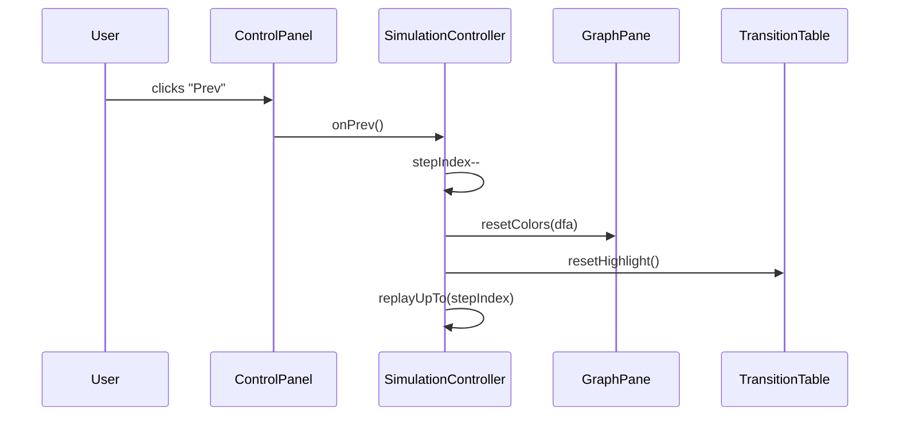

# Design Document: DFA Run / Simulation Feature

## Overview

The DFA Run/Simulation feature connects the existing `DFASimulator` engine to the JavaFX UI so that every step of a simulation is visually reflected in real time: the active state glows in `GraphPane`, the matching row/cell lights up in `TransitionTable`, the input string shows a character-by-character read cursor, and the `ControlPanel` drives the whole animation with Play / Pause / Next / Prev / Reset controls.

The backend simulation logic (`DFASimulator`, `SimulationStep`) is already complete and correct. The gap is that `ControlPanel` never calls `graphPane.highlightState()` or `transitionTable.highlight()` during `applyStep()` because it holds no references to those panels. This feature wires those references together and enriches the step-by-step playback with full visual feedback.

The design also adds a character-cursor display in `InputPanel` so the user can see which symbol is currently being consumed, and introduces a `SimulationController` helper that owns the cross-panel coordination logic, keeping each UI class focused on its own rendering responsibility.

---

## Architecture



`SimulationController` is the single owner of the `Timeline` and `stepIndex`. All four UI panels are injected into it at construction time (in `MainApp`). `ControlPanel` becomes a pure view — it fires button events upward to `SimulationController` and receives display commands back.

---

## Sequence Diagrams

### Generate + Start Simulation



### Step-Back (Prev)



---

## Components and Interfaces

### SimulationController

**Purpose**: Owns the animation timeline and coordinates all cross-panel visual updates during simulation playback.

**Interface**:
```java
public class SimulationController {
    // Inject all panels at construction
    SimulationController(GraphPane gp, TransitionTable tt,
                         InputPanel ip, ControlPanel cp);

    // Called by InputPanel after DFA generation
    void setDFA(DFA dfa, String inputString);

    // Called by InputPanel's "Start Simulation" button
    void startSimulation();

    // Called by ControlPanel button handlers
    void onPlay();
    void onPause();
    void onNext();
    void onPrev();
    void onReset();

    // Called by ControlPanel speed slider listener
    void setSpeed(double millisPerStep);
}
```

**Responsibilities**:
- Holds `List<SimulationStep>` and `stepIndex`
- Owns and manages the JavaFX `Timeline`
- Calls `graphPane.highlightState()` / `graphPane.resetColors()`
- Calls `transitionTable.highlight()` / `transitionTable.resetHighlight()`
- Calls `inputPanel.showCursor(int charIndex)`
- Calls `controlPanel.appendLog()` / `controlPanel.showResult()`
- Enables/disables control buttons via `controlPanel.setButtonState()`

---

### GraphPane (existing — minor additions)

**Purpose**: Renders the DFA graph; already has `highlightState()` and `resetColors()`. Needs a `markVisited()` method so previously-traversed states stay blue while the current state glows yellow.

**New / changed interface**:
```java
// Already exists — no change needed
void highlightState(String name, Color color);
void resetColors(DFA dfa);

// NEW: paint a state with COL_VISITED without the glow effect
void markVisited(String name);
```

**Responsibilities** (unchanged): draw states, transitions, self-loops, start arrow, respond to highlight calls.

---

### TransitionTable (existing — no changes needed)

`highlight(String stateName, char symbol)` and `resetHighlight()` are already implemented and correct.

---

### ControlPanel (existing — refactored)

**Purpose**: Pure view for simulation controls. Removes its own `Timeline` and `stepIndex` fields; delegates all logic to `SimulationController`.

**Changed interface**:
```java
// Replaces the old setDFA / startSimulation / onPlay / etc. methods
void setController(SimulationController controller);

// Called by SimulationController to update display
void appendLog(String text);
void showResult(boolean accepted);
void setButtonState(boolean playing);  // toggles play/pause enable state
void clearLog();
```

Button `onAction` handlers become one-liners that call `controller.onPlay()`, etc.

---

### InputPanel (existing — minor addition)

**Purpose**: TOP panel; already handles Generate and Start Simulation. Needs a cursor display to show which character is being read.

**New interface**:
```java
// NEW: highlights character at index in the input string display
void showCursor(int charIndex);

// NEW: clears the cursor highlight
void clearCursor();
```

Implementation: replace the plain `inputStringField` with a read-only `HBox` of styled `Label` characters during simulation, or overlay a highlight rectangle. The simpler approach is a separate `Label cursorLabel` below the field that shows e.g. `"Reading: 'b' (pos 3)"`.

---

## Data Models

### SimulationStep (existing — no changes)

```java
public static class SimulationStep {
    String fromState;   // state before consuming symbol
    char   symbol;      // '\0' for START/ACCEPT/REJECT steps
    String toState;     // null for DEAD steps
    String type;        // START | MOVE | DEAD | ACCEPT | REJECT
}
```

### SimulationState (new — internal to SimulationController)

```java
// Tracks mutable playback state; not a public class
private DFA                  currentDFA;
private String               inputString;
private List<SimulationStep> steps;
private int                  stepIndex;
private Timeline             timeline;
private double               msPerStep = 800;
private Set<String>          visitedStates = new LinkedHashSet<>();
```

---

## Key Functions with Formal Specifications

### SimulationController.advanceStep()

```java
private void advanceStep()
```

**Preconditions:**
- `steps != null && !steps.isEmpty()`
- `stepIndex >= 0 && stepIndex < steps.size()`
- `currentDFA != null`

**Postconditions:**
- `stepIndex` is incremented by exactly 1
- `graphPane` reflects the state color for `steps.get(old_stepIndex)`
- `transitionTable` highlights the row/cell for `steps.get(old_stepIndex)` if type is MOVE
- If `stepIndex >= steps.size()` after increment, `timeline` is stopped and play button re-enabled
- No mutation to `steps` or `currentDFA`

**Loop Invariants:** N/A (no loop; called repeatedly by Timeline)

---

### SimulationController.replayUpTo(int targetIndex)

```java
private void replayUpTo(int targetIndex)
```

**Preconditions:**
- `targetIndex >= 0`
- `steps != null`
- `currentDFA != null`

**Postconditions:**
- `graphPane` and `transitionTable` reflect the visual state as if steps `[0, targetIndex)` were applied in order
- `visitedStates` contains exactly the states visited in steps `[0, targetIndex)`
- `controlPanel` log contains exactly the text for steps `[0, targetIndex)`
- `stepIndex == targetIndex`

**Loop Invariants:**
- After processing step `i`: `visitedStates` contains all `fromState` values from steps `[0, i]`
- `graphPane` color for each visited state is `COL_VISITED`

---

### SimulationController.applyStep(SimulationStep step)

```java
private void applyStep(SimulationStep step)
```

**Preconditions:**
- `step != null`
- `graphPane`, `transitionTable`, `controlPanel`, `inputPanel` are non-null

**Postconditions (by step type):**

| Type   | GraphPane effect                          | Table effect                    | Log text                              |
|--------|-------------------------------------------|---------------------------------|---------------------------------------|
| START  | `highlightState(fromState, COL_CURRENT)`  | none                            | `"▶ Start: q0"`                       |
| MOVE   | mark `fromState` visited; highlight `toState` as current | `highlight(fromState, symbol)` | `"q0 --a--> q1"`           |
| DEAD   | `highlightState(fromState, COL_DEAD)`     | none                            | `"💀 Dead from q2 on 'b'"`            |
| ACCEPT | `highlightState(fromState, COL_FINAL)`    | none                            | `"✅ Accepted at: q3"`                |
| REJECT | `highlightState(fromState, COL_DEAD)`     | none                            | `"❌ Rejected at: q1"`                |

---

## Algorithmic Pseudocode

### Main Simulation Playback Loop

```pascal
PROCEDURE advanceStep()
  IF steps = null OR stepIndex >= steps.size() THEN
    timeline.stop()
    controlPanel.setButtonState(playing = false)
    RETURN
  END IF

  step ← steps[stepIndex]
  applyStep(step)
  stepIndex ← stepIndex + 1

  IF stepIndex >= steps.size() THEN
    timeline.stop()
    controlPanel.setButtonState(playing = false)
  END IF
END PROCEDURE
```

### Apply Single Step

```pascal
PROCEDURE applyStep(step)
  SWITCH step.type
    CASE "START":
      graphPane.highlightState(step.fromState, COL_CURRENT)
      inputPanel.showCursor(0)
      controlPanel.appendLog("▶ Start: " + step.fromState)

    CASE "MOVE":
      graphPane.markVisited(step.fromState)
      visitedStates.add(step.fromState)
      graphPane.highlightState(step.toState, COL_CURRENT)
      transitionTable.highlight(step.fromState, step.symbol)
      inputPanel.showCursor(charIndexOf(step))
      controlPanel.appendLog(step.fromState + " --" + step.symbol + "--> " + step.toState)

    CASE "DEAD":
      graphPane.highlightState(step.fromState, COL_DEAD)
      controlPanel.appendLog("💀 Dead state from " + step.fromState + " on '" + step.symbol + "'")
      controlPanel.showResult(false)

    CASE "ACCEPT":
      graphPane.highlightState(step.fromState, COL_FINAL)
      inputPanel.clearCursor()
      controlPanel.appendLog("✅ Accepted at: " + step.fromState)
      controlPanel.showResult(true)

    CASE "REJECT":
      graphPane.highlightState(step.fromState, COL_DEAD)
      inputPanel.clearCursor()
      controlPanel.appendLog("❌ Rejected at: " + step.fromState)
      controlPanel.showResult(false)
  END SWITCH
END PROCEDURE
```

### Replay (for Prev button)

```pascal
PROCEDURE replayUpTo(targetIndex)
  graphPane.resetColors(currentDFA)
  transitionTable.resetHighlight()
  controlPanel.clearLog()
  inputPanel.clearCursor()
  visitedStates.clear()

  FOR i FROM 0 TO targetIndex - 1 DO
    ASSERT i < steps.size()
    applyStep(steps[i])
  END FOR

  stepIndex ← targetIndex
END PROCEDURE
```

---

## Example Usage

```java
// In MainApp.start():
GraphPane       graphPane       = new GraphPane();
TransitionTable transitionTable = new TransitionTable();
ControlPanel    controlPanel    = new ControlPanel();
InputPanel      inputPanel      = new InputPanel();

SimulationController controller = new SimulationController(
    graphPane, transitionTable, inputPanel, controlPanel
);

inputPanel.setController(controller);
controlPanel.setController(controller);

// When user clicks "Generate DFA" in InputPanel:
DFA dfa = DFAGenerator.generate("ends with abb", "ab");
graphPane.drawDFA(dfa);
transitionTable.populate(dfa);
controller.setDFA(dfa, "aabbabb");

// When user clicks "Start Simulation":
controller.startSimulation();
// → Timeline fires every 800ms
// → Each tick: graphPane glows current state, table highlights cell, log appends

// When user clicks "Next" manually:
controller.onNext();   // advances one step, pauses timeline

// When user clicks "Prev":
controller.onPrev();   // decrements stepIndex, replays from 0 to stepIndex
```

---

## Correctness Properties

- For any valid DFA and input string, the number of MOVE steps equals `inputString.length()` (or fewer if a DEAD step occurs).
- After `simulate()` completes, `steps.get(steps.size()-1).getType()` is always one of `{ACCEPT, REJECT, DEAD}`.
- `replayUpTo(n)` followed by `advanceStep()` produces the same visual state as having called `advanceStep()` n+1 times from the start.
- `resetColors()` followed by `replayUpTo(0)` leaves all states in their default (inactive/final) colors with no highlights.
- The `visitedStates` set after full playback contains exactly the set of states traversed, with no duplicates.
- Speed slider changes take effect on the next Timeline cycle without interrupting the current step.

---

## Error Handling

### No DFA Generated

**Condition**: User clicks "Start Simulation" before clicking "Generate DFA".
**Response**: `InputPanel.onSimulate()` checks `currentDFA == null` and shows a warning status label. `SimulationController.startSimulation()` is not called.
**Recovery**: User generates a DFA first.

### Empty Input String

**Condition**: Input string field is blank.
**Response**: `DFASimulator` receives `""`. The simulator produces a START step followed immediately by ACCEPT or REJECT depending on whether the start state is a final state. This is correct DFA semantics (ε-string).
**Recovery**: No recovery needed; this is valid behavior.

### Dead State Reached

**Condition**: No transition exists for the current state + symbol pair.
**Response**: `DFASimulator` emits a DEAD step. `applyStep()` colors the state red, appends the dead-state log message, shows REJECTED result, and stops the timeline.
**Recovery**: User can reset and try a different input string.

### DFA with No Start State

**Condition**: A manually constructed DFA has `getStartState() == null`.
**Response**: `DFASimulator.simulate()` logs an error and returns with an empty steps list. `SimulationController.startSimulation()` detects `steps.isEmpty()` and shows a status warning.
**Recovery**: Ensure DFA is properly constructed via `DFAGenerator`.

---

## Testing Strategy

### Unit Testing Approach

Test `DFASimulator` in isolation (already partially covered by `Phase1Test` and `Phase2Test`):
- Verify step count equals `input.length() + 2` (START + n MOVEs + terminal) for non-dead paths.
- Verify `isAccepted()` matches expected result for all generator types.
- Verify DEAD step is emitted at the correct position when no transition exists.
- Verify empty string produces `[START, ACCEPT/REJECT]` with no MOVE steps.

Test `SimulationController` with mock/stub panels:
- `advanceStep()` increments `stepIndex` exactly once per call.
- `replayUpTo(n)` results in `stepIndex == n` and calls `applyStep` exactly n times.
- `onPrev()` at `stepIndex == 0` does not decrement below 0.
- `onPrev()` at `stepIndex == 1` replays to index 0 (START state only).

### Property-Based Testing Approach

**Property Test Library**: JUnit 5 with manual parameterized tests (or QuickTheories if added as a dependency).

Key properties:
- For any accepted string `s` and DFA `d`: `simulate(d, s).isAccepted() == true` and last step type is ACCEPT.
- For any rejected string `s`: last step type is REJECT or DEAD.
- `replayUpTo(k)` then `advanceStep()` k times produces the same `stepIndex` as calling `advanceStep()` 2k times from reset.
- Step list length is always `>= 2` (at minimum START + terminal).

### Integration Testing Approach

Manual UI smoke tests (JavaFX TestFX if added):
- Generate "ends with abb", input "aabbabb" → all 4 states visited in order, final state glows green, ACCEPTED shown.
- Generate "contains 101", input "100" → DEAD or REJECTED shown, red highlight on stuck state.
- Click Prev repeatedly from end → log shrinks correctly, graph colors rewind.
- Drag speed slider to Fast → Timeline interval decreases, animation visibly speeds up.

---

## Performance Considerations

- `replayUpTo(n)` replays from step 0 every time Prev is clicked. For typical DFAs (< 20 states, < 50 steps) this is imperceptible. If very long inputs are supported in the future, a snapshot cache (store `visitedStates` at each step) can make Prev O(1).
- `GraphPane.resetColors()` iterates all states — O(|states|) — which is fine for any realistic DFA.
- The `Timeline` fires on the JavaFX Application Thread; all `applyStep` work is lightweight label/color updates, so no background threading is needed.

---

## Security Considerations

- Input strings are processed locally with no network calls; no injection risk.
- Alphabet and condition strings are validated by `DFAGenerator` before any DFA is built; malformed input throws `IllegalArgumentException` caught and displayed in the status label.

---

## Dependencies

- JavaFX 17+ (`javafx.controls`, `javafx.animation`) — already in project
- `simulator.DFASimulator` — already implemented
- `model.DFA`, `model.State`, `model.Transition` — already implemented
- `generator.DFAGenerator` — already implemented
- `ui.GraphPane`, `ui.TransitionTable`, `ui.ControlPanel`, `ui.InputPanel` — already implemented; require targeted refactoring
- No new external libraries required
